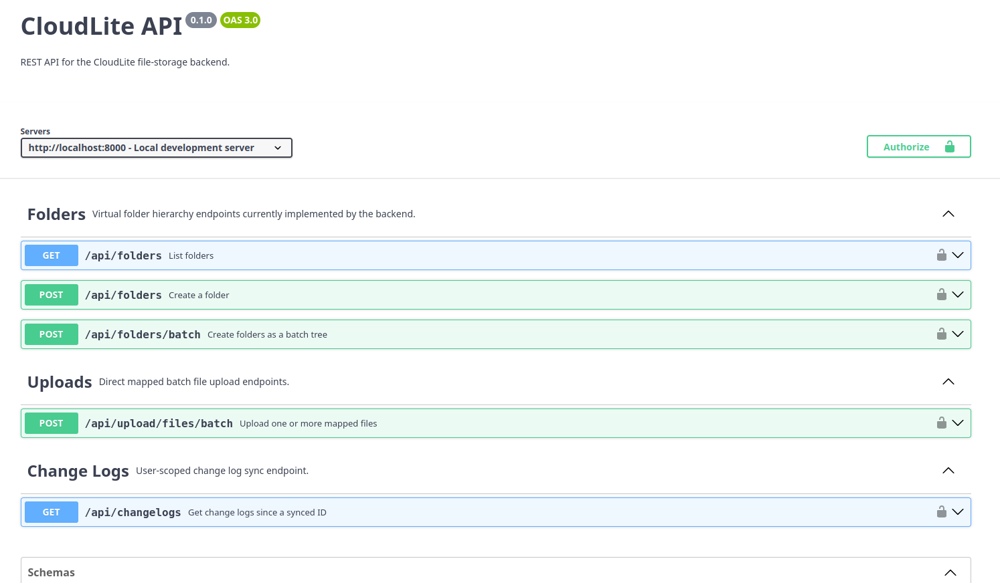

# CloudLite Backend

CloudLite Backend is a Spring Boot service for CloudLite, a lightweight
self-hosted cloud storage project inspired by Nextcloud-style file sync, built
mainly for learning and experimentation.

The service provides the central API for authenticated desktop clients,
storing file and folder metadata, uploading file content, and exposing changes
for synchronization.

[](docs/)

## Scope

- [x] Provide a Spring Boot backend API with PostgreSQL persistence.
- [x] Authenticate requests through Keycloak using OAuth2 bearer JWTs.
- [x] Create and browse folder hierarchies.
- [x] Stream mapped batch uploads to user-specific local filesystem paths.
- [x] Store upload metadata and SHA-256 checksums in PostgreSQL.
- [x] Expose changelog entries for client synchronization.
- [ ] Complete file browsing, download, rename, move, and delete operations.
- [ ] Complete folder rename, move, and delete operations.
- [ ] Add an object-storage implementation backed by RustFS.

CloudLite frontend repository: [cloudlite-frontend](https://github.com/kr1pt0n05/cloudlite-frontend)

## Architecture

- Swagger (OpenAPI) documents the API: [docs/swagger.yaml](docs/swagger.yaml).
- Keycloak and OAuth2 provide authentication.
- Spring Boot exposes the REST endpoints.
- PostgreSQL stores metadata.
- File content is currently stored on the local filesystem and will later be
  moved to object-based storage using RustFS as a MinIO alternative.

## Setup

### Prerequisites

Install the following before starting:

- Java 25.
- Docker with Docker Compose.
- A POSIX-compatible shell for the Maven Wrapper (`./mvnw`).

The development stack uses these local endpoints by default:

- Backend API: `http://localhost:8000`
- Keycloak realm: `http://localhost:8080/realms/development`
- PostgreSQL: `localhost:5432`

### Run the Application

1. Clone the repository and enter the backend directory:

   ```bash
   git clone https://github.com/kr1pt0n05/cloudlite-backend.git
   cd cloudlite-backend
   ```

2. Create a local `.env` file for Docker Compose and Spring Boot:

   ```dotenv
   PORT=8000
   ALLOWED_ORIGIN=http://localhost:4200

   POSTGRES_HOST=localhost
   POSTGRES_PORT=5432
   POSTGRES_USER=cloudlite
   POSTGRES_PASSWORD=cloudlite
   POSTGRES_DB=cloudlite

   KC_PORT=8080
   KC_USERNAME=admin
   KC_PASSWORD=admin
   KC_POSTGRES_DB=keycloak
   KC_POSTGRES_USER=keycloak
   KC_POSTGRES_PASSWORD=keycloak
   KEYCLOAK_FRONTEND_CLIENT_ID=frontend-client

   ISSUER_URI=http://localhost:8080/realms/development
   FILE_STORAGE_PATH=./.uploads
   JPA_HIBERNATE_DDL_AUTO=create-drop
   ```

3. Start PostgreSQL and Keycloak. The Keycloak container imports
   `import/development-realm.json`, including the `frontend-client` client:

   ```bash
   docker compose up -d
   ```

4. Load the same local configuration into the shell and start the backend:

   ```bash
   set -a
   . ./.env
   set +a
   ./mvnw spring-boot:run
   ```

   This explicitly supplies the repository `.env` values when Maven is run
   from the repository root; `application.yaml` currently imports
   `../.env` as its optional file-based configuration location.

5. Run the CloudLite frontend or another OAuth2 client against the imported
   Keycloak realm. Protected API requests must include the issued bearer access
   token.

Development note: `JPA_HIBERNATE_DDL_AUTO=create-drop` recreates the application
schema when the backend starts, so local metadata is not retained between runs.
